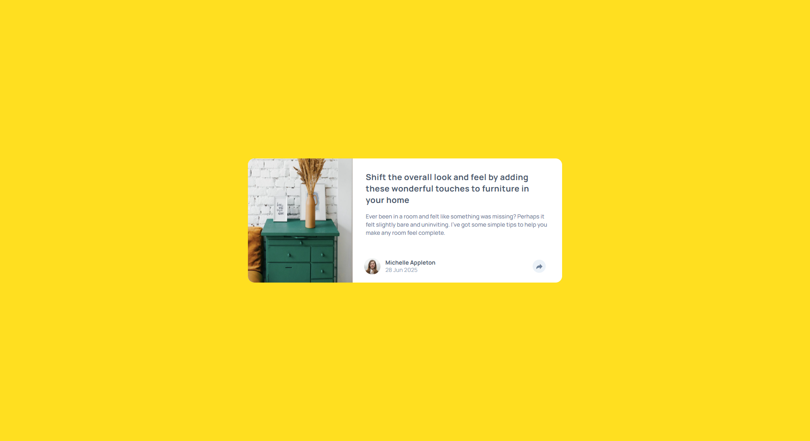
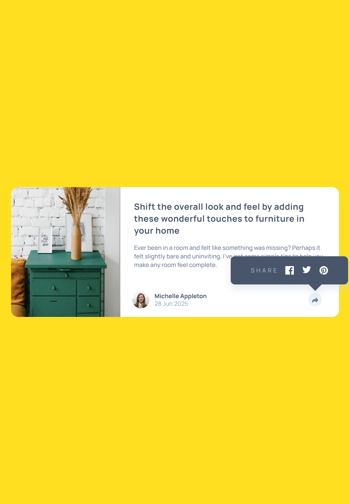
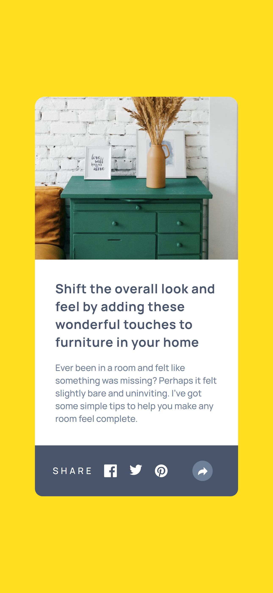

# Frontend Mentor - Article preview component solution

This is a solution to the [Article preview component challenge on Frontend Mentor](https://www.frontendmentor.io/challenges/article-preview-component-dYBN_pYFT). Frontend Mentor challenges help you improve your coding skills by building realistic projects. 

## Overview

### The challenge

Users should be able to:

- [x] View the optimal layout for the component depending on their device's screen size
- [x] See the social media share links when they click the share icon

### Screenshot

#### Desktop:

#### Tablet:

#### Mobile:

## My process

### Built with

- Mobile-first workflow
- [Helipopper](https://github.com/ngneat/helipopper)
- [TailwindCSS](https://tailwindcss.com/)
- [Angular](https://angular.dev/)

## Author

- [Website](https://www.ckarakoc.nl)
- [LinkedIn](https://www.linkedin.com/in/celal-karakoç/)

## Acknowledgments

- [Frontend Mentor](https://www.frontendmentor.io)
