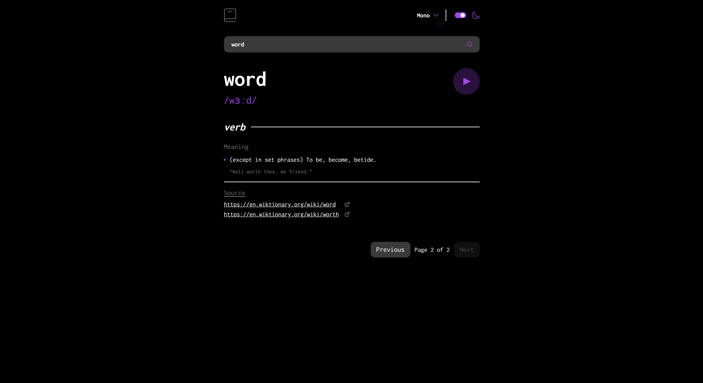
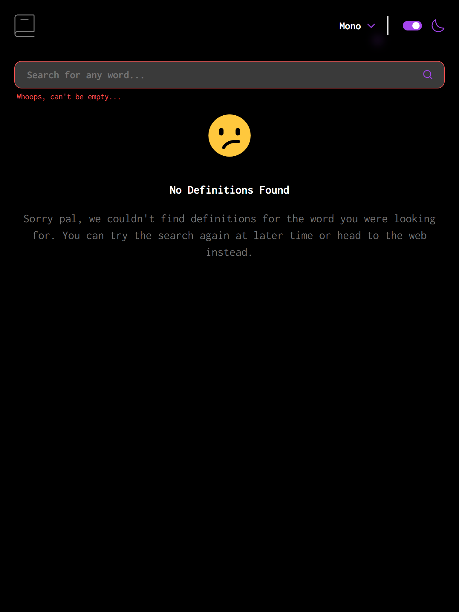
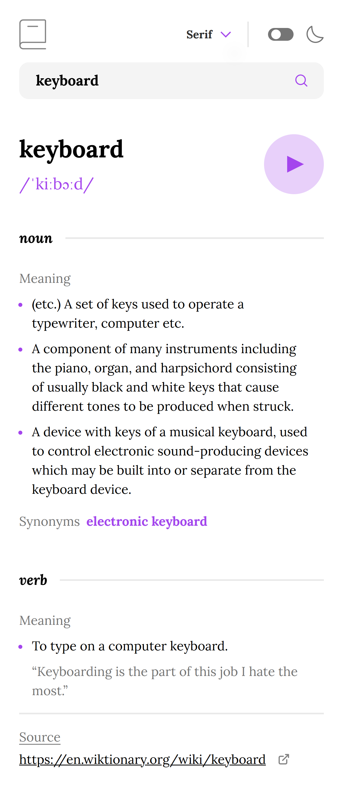

# Frontend Mentor - Dictionary web app solution

This is a solution to the [Dictionary web app challenge on Frontend Mentor](https://www.frontendmentor.io/challenges/dictionary-web-app-h5wwnyuKFL). Frontend Mentor challenges help you improve your coding skills by building realistic projects.

## Overview

### The challenge

Users should be able to:

- [x] Search for words using the input field
- [x] See the Free Dictionary API's response for the searched res
- [x] See a form validation message when trying to submit a blank form
- [x] Play the audio file for a res when it's available
- [x] Switch between serif, sans serif, and monospace fonts
- [x] Switch between light and dark themes
- [x] View the optimal layout for the interface depending on their device's screen size
- [x] See hover and focus states for all interactive elements on the page
- [x] **Bonus**: Have the correct color scheme chosen for them based on their computer preferences. _Hint_: Research `prefers-color-scheme` in CSS.

### Screenshot

#### Desktop:

#### Tablet:

#### Mobile:

## My process

### Built with

- [TailwindCSS](https://tailwindcss.com/)
- [Angular](https://angular.dev/)

## Author

- [Website](https://www.ckarakoc.nl)
- [LinkedIn](https://www.linkedin.com/in/celal-karakoç/)

## Acknowledgments

- [Frontend Mentor](https://www.frontendmentor.io)
