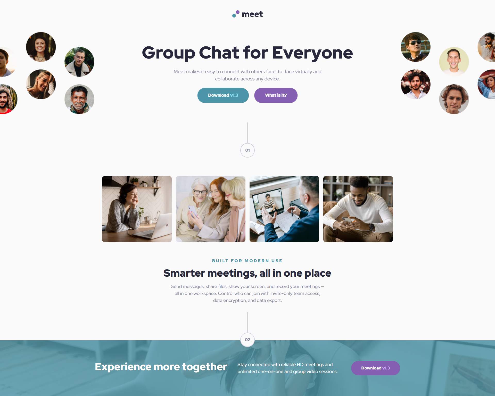
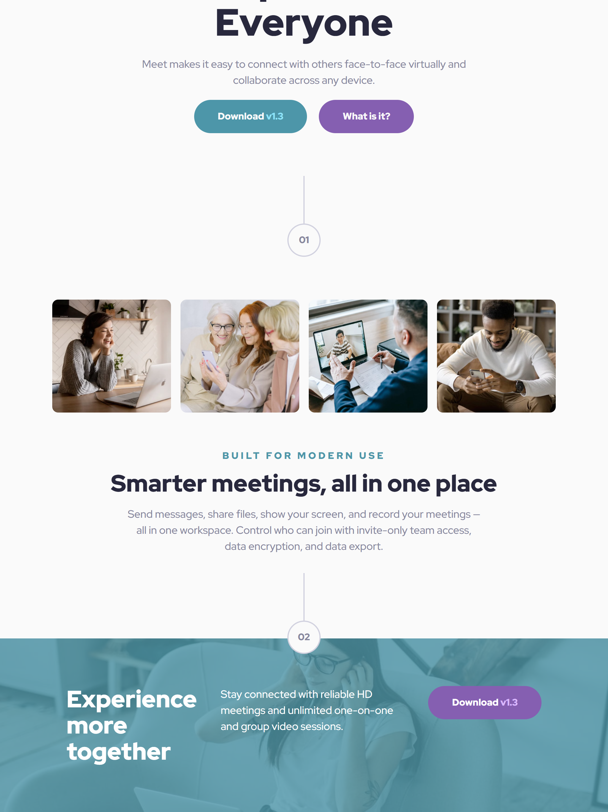
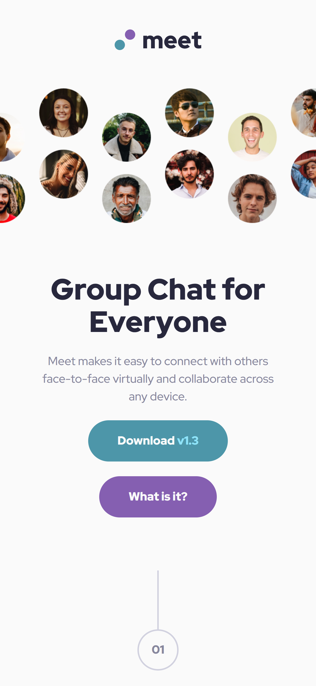

# Frontend Mentor - Meet landing page solution

This is a solution to the [Meet landing page challenge on Frontend Mentor](https://www.frontendmentor.io/challenges/meet-landing-page-rbTDS6OUR). Frontend Mentor challenges help you improve your coding skills by building realistic projects.

## Overview

### The challenge

Users should be able to:

- [x] View the optimal layout depending on their device's screen size
- [x] See hover states for interactive elements

### Screenshot

#### Desktop:

#### Tablet:

#### Mobile:

## My process

### Built with

- Plain HTML and CSS
- Mobile-first workflow
- [Angular](https://angular.dev/)

## Author

- [Website](https://www.ckarakoc.nl)
- [LinkedIn](https://www.linkedin.com/in/celal-karakoç/)

## Acknowledgments

- [Frontend Mentor](https://www.frontendmentor.io)
- [Bennett Feely](https://bennettfeely.com/clippy/)
