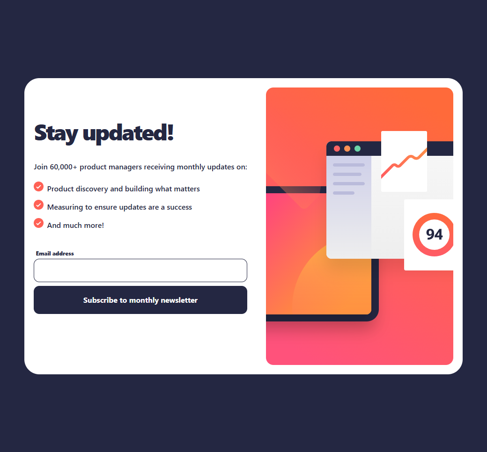
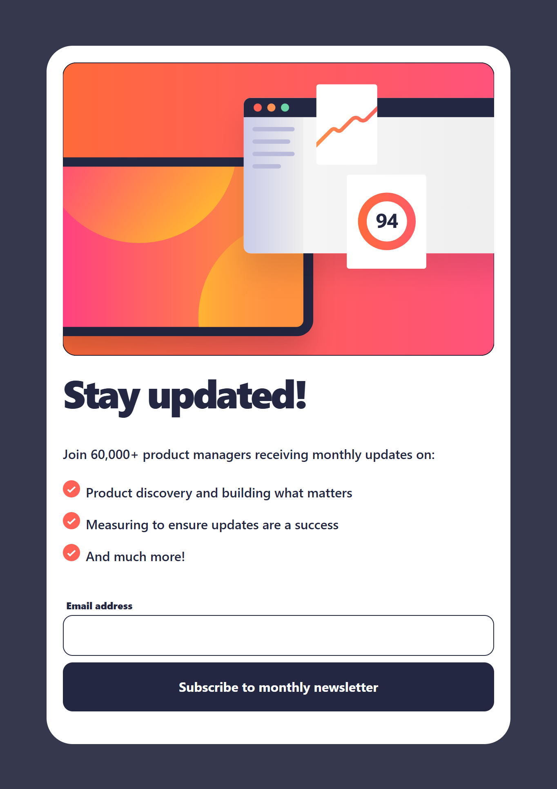
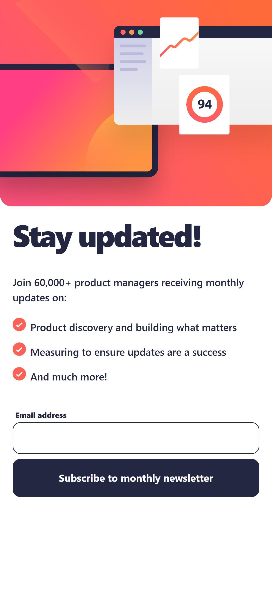

# Frontend Mentor - Newsletter sign-up form with success message solution

This is a solution to the [Newsletter sign-up form with success message challenge on Frontend Mentor](https://www.frontendmentor.io/challenges/newsletter-signup-form-with-success-message-3FC1AZbNrv). Frontend Mentor challenges help you improve your coding skills by building realistic projects.

## Overview

### The challenge

Users should be able to:

- [x] Add their email and submit the form
- [x] See a success message with their email after successfully submitting the form
- [x] See form validation messages if:
  - [x] The field is left empty
  - [x] The email address is not formatted correctly
- [x] View the optimal layout for the interface depending on their device's screen size
- [x] See hover and focus states for all interactive elements on the page

### Screenshot

#### Desktop:

#### Tablet:

#### Mobile:

## My process

### Built with

- Mobile-first workflow
- [TailwindCSS](https://tailwindcss.com/)
- [Angular](https://angular.dev/)

## Author

- [Website](https://www.ckarakoc.nl)
- [LinkedIn](https://www.linkedin.com/in/celal-karakoç/)

## Acknowledgments

- [Frontend Mentor](https://www.frontendmentor.io)
