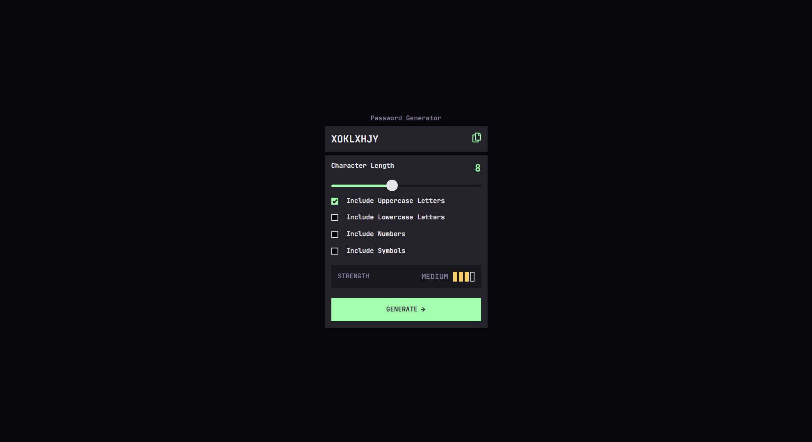
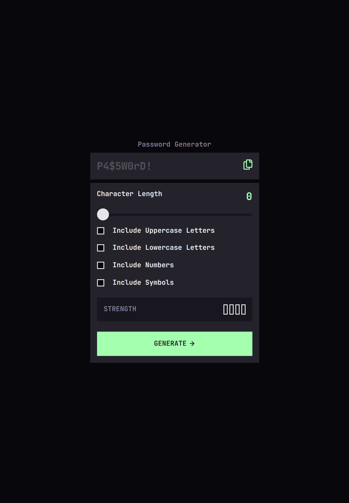
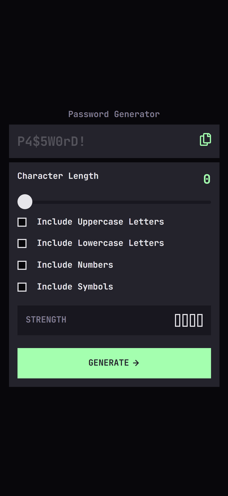

# Frontend Mentor - Password generator app solution

This is a solution to the [Password generator app challenge on Frontend Mentor](https://www.frontendmentor.io/challenges/password-generator-app-Mr8CLycqjh). Frontend Mentor challenges help you improve your coding skills by building realistic projects.

## Overview

### The challenge

Users should be able to:

- [ ] Generate a password based on the selected inclusion options
- [ ] Copy the generated password to the computer's clipboard
- [ ] See a strength rating for their generated password
- [ ] View the optimal layout for the interface depending on their device's screen size
- [ ] See hover and focus states for all interactive elements on the page

### Screenshot

#### Desktop:

#### Tablet:

#### Mobile:

## My process

### Built with

- [TailwindCSS](https://tailwindcss.com/)
- [Angular](https://angular.dev/)

## Author

- [Website](https://www.ckarakoc.nl)
- [LinkedIn](https://www.linkedin.com/in/celal-karakoç/)

## Acknowledgments

- [Frontend Mentor](https://www.frontendmentor.io)
