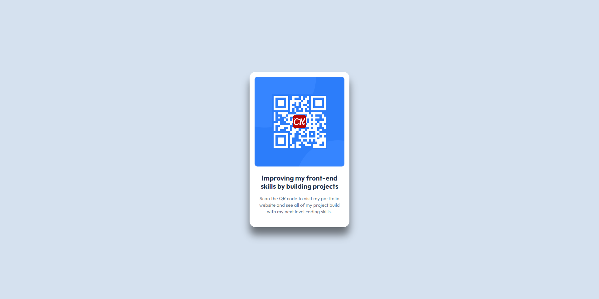

# Frontend Mentor - QR code component solution

This is a solution to the [QR code component challenge on Frontend Mentor](https://www.frontendmentor.io/challenges/qr-code-component-iux_sIO_H). Frontend Mentor challenges help you improve your coding skills by building realistic projects.

## Overview

### Screenshot

#### Desktop:

#### Mobile:

## My process

### Built with

- Semantic HTML5 markup
- Mobile-first workflow
- [Angular](https://angular.dev/)
- [angularx-qrcode](https://www.npmjs.com/package/angularx-qrcode)

## Author

- [Website](https://www.ckarakoc.nl)
- [LinkedIn](https://www.linkedin.com/in/celal-karakoç/)

## Acknowledgments

- [Frontend Mentor](https://www.frontendmentor.io)
- [Bennett Feely](https://bennettfeely.com/clippy/)
